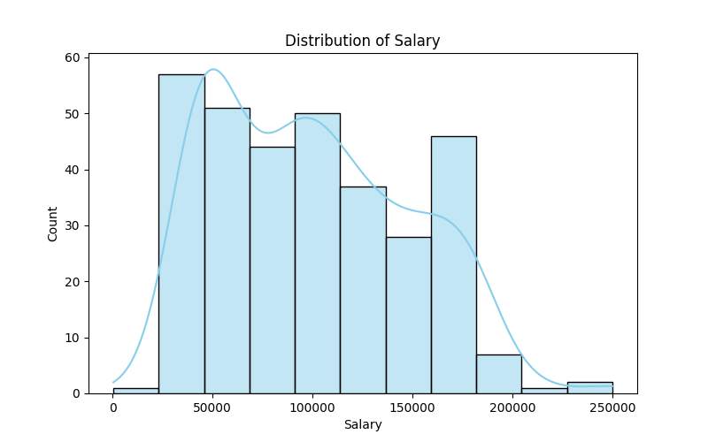
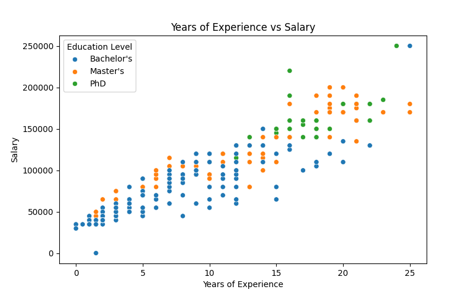
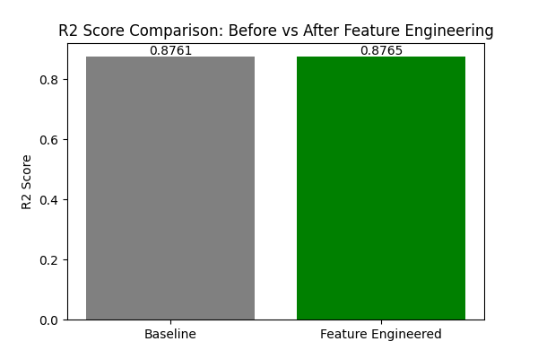
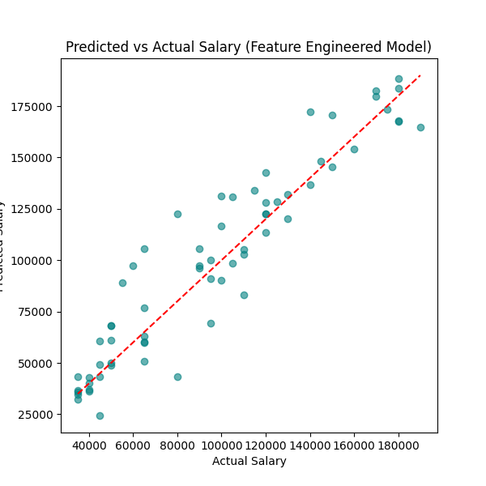

# Salary Prediction

## Problem Statement
HR teams often struggle to decide a fair salary for a new candidate. This project tries to predict a candidate's salary using their age, education level, job title and years of experience, so that HR can make more consistent and less biased pay decisions.

## Dataset
- **Name:** Salary Prediction Dataset
- **Source:** Kaggle
- **Link:** https://www.kaggle.com/datasets/rkiattisak/salaly-prediction-for-beginer
- **Rows / Columns:** 375 rows, 6 columns (after cleaning: 323 rows)

## Tools Used
- Python
- Pandas, NumPy
- Matplotlib, Seaborn
- Scikit-learn

## Workflow
1. Data Collection
2. Data Cleaning
3. Exploratory Data Analysis (EDA)
4. Feature Engineering
5. Model Building (Linear Regression)
6. Evaluation
7. Insights & Recommendations

## Results
- **Model:** Linear Regression
- **Key Metrics:**
  - Baseline model → R2 = 0.8761, MAE = 11987.10, RMSE = 16284.84
  - Feature Engineered model → R2 = 0.8765, MAE = 11844.78, RMSE = 16260.04
- **Additional Requirement (Feature Engineering):** Added two new features - `experience_level` (Entry/Mid/Senior bucket) and `age_experience_ratio` (Age / Years of Experience). Together they improved R2 from 0.8761 to 0.8765 and reduced both MAE and RMSE, using the exact same train-test split for both models so the comparison is fair. When tested separately, `age_experience_ratio` alone actually gave the biggest single boost (R2 = 0.8767), slightly more than the combined model, while `experience_level` alone was close to the baseline. So `age_experience_ratio` seems to be the more useful of the two features here.
- **Top Factors / Drivers:** Years of Experience and Job Title had the strongest effect on salary, followed by Education Level. Age on its own added less once experience was already in the model.

## Screenshots

## Future Improvements
- Try a Random Forest or Gradient Boosting model and compare with Linear Regression
- Collect more rows since a lot of job titles only appear once or twice
- Try target encoding for Job Title instead of just grouping rare ones into "Other"
- Deploy the model as a simple Streamlit web app so HR can enter candidate details and get a predicted salary

## Author
Tanmay Joshi | www.linkedin.com/in/tanmay-joshi06
